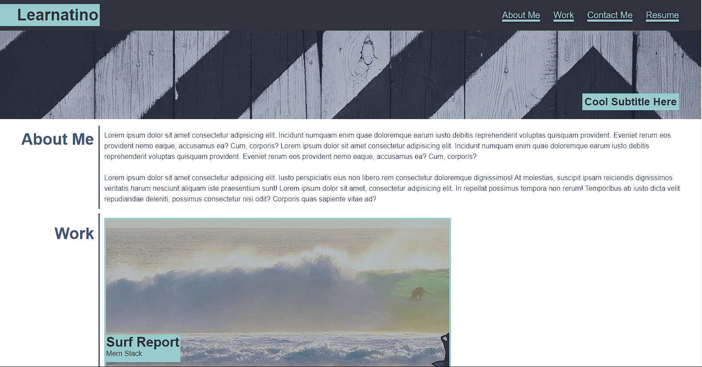
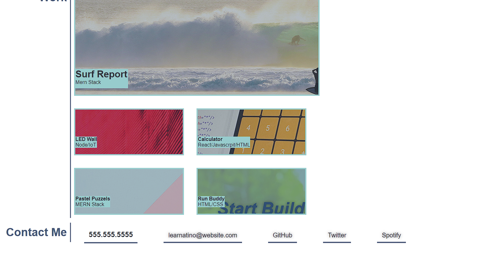
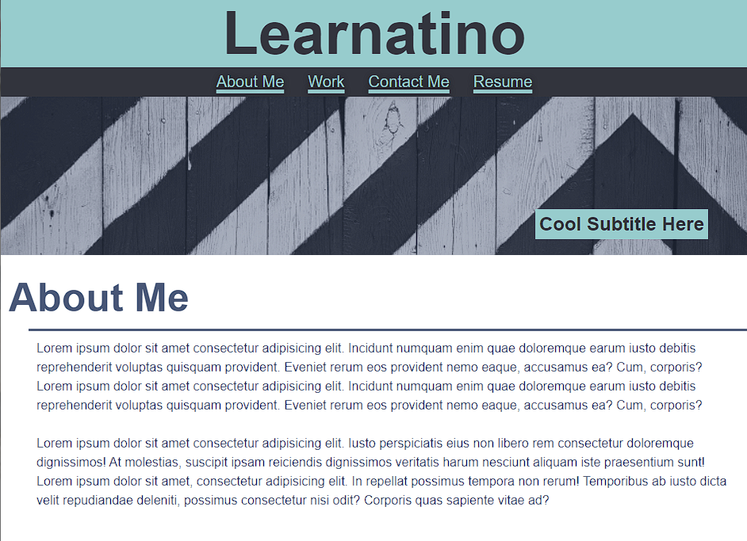
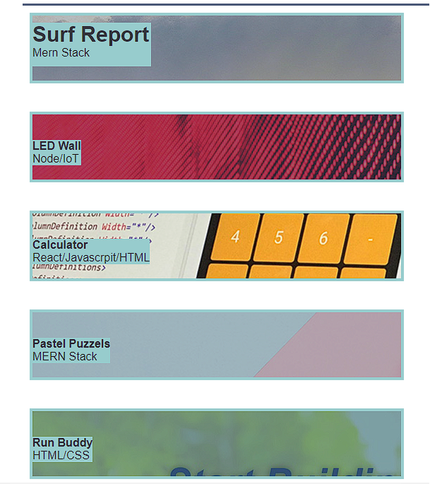

# Portfolio

## Table of contents

*[What](#what)

*[Screenshot](#screenshot)

*[What I learned](#what-i-learned)

*[Links](#links)

## What

This is a professional porfolio template plage that can be customzied very easily. It uses flexbox css and html.
Included are 2 media query breakpoints. Through dedication and hard work I can keep this maintained and use a
version of it for myself. All html and CSS is commented structurally so all code is east to decipher.

## Screenshot

## What I Learned

Throughout this challenge, I came across many speed bumps. Utilizing Google and the TA's i was able to overcome all
obstacles. Using DevTools in google chrome was a life saver. It makes styling through CSS much easier.

## Links

/https://bmkersey.github.io/portfolio/